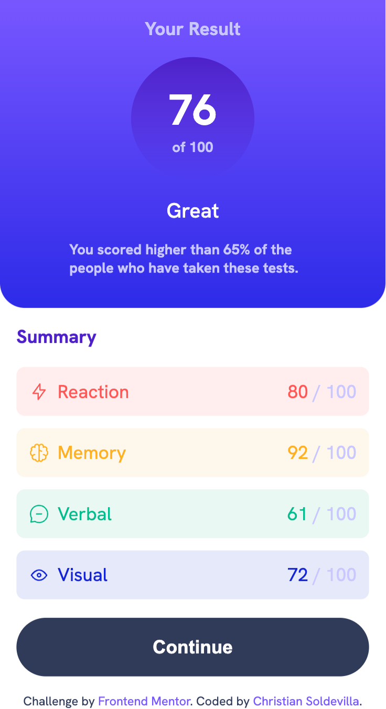
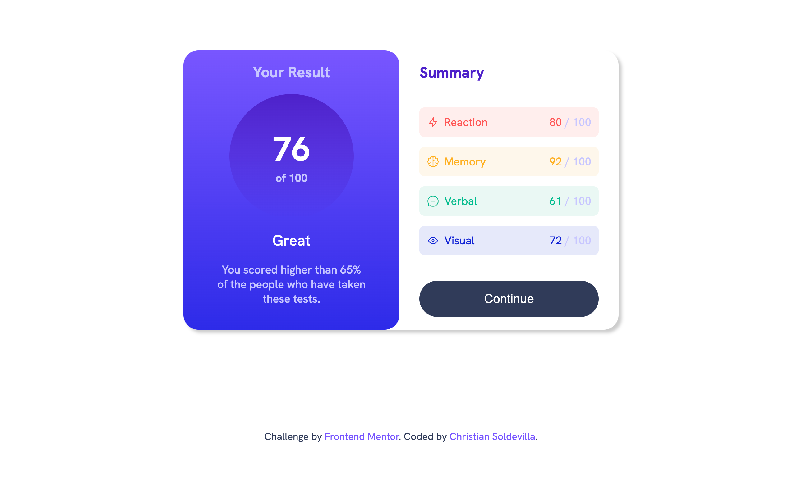

# Frontend Mentor - Results summary component solution

This is a solution to the [Results summary component challenge on Frontend Mentor](https://www.frontendmentor.io/challenges/results-summary-component-CE_K6s0maV). Frontend Mentor challenges help you improve your coding skills by building realistic projects. 

## Table of contents

- [Overview](#overview)
  - [The challenge](#the-challenge)
  - [Screenshot](#screenshot)
  - [Links](#links)
- [My process](#my-process)
  - [Built with](#built-with)
  - [What I learned](#what-i-learned)
  - [Useful resources](#useful-resources)
- [Author](#author)

## Overview

This challenge has something for everyone. It’s a HTML and CSS only project, but we’ve also provided a JSON file of the test results for anyone wanting to practice JS.

### The challenge

Users should be able to:

- View the optimal layout for the interface depending on their device's screen size
- See hover and focus states for all interactive elements on the page
- **Bonus**: Use the local JSON data to dynamically populate the content

### Screenshot

### Links

- Solution URL: [github.com/soldochris/results-summary-component](https://github.com/soldochris/results-summary-component)
- Live Site URL: [results-summary-component-aml5zufn8-soldochris-projects.vercel.app](https://results-summary-component-aml5zufn8-soldochris-projects.vercel.app/)

## My process

### Built with

- Semantic HTML5 markup
- CSS custom properties
- Flexbox
- Mobile-first workflow
- [React](https://reactjs.org/) - JS library

### What I learned

I learned how to fetch data from a local JSON file using useEffect and useState in React.

### Useful resources

- [escuelafrontend.com/data-fetching-con-react](https://www.escuelafrontend.com/data-fetching-con-react) - This helped me to recall how to fetching data using use effect. It is written in a very comprehensible way.

## Author

- Website - [christiansoldevilla.tech](https://christiansoldevilla.tech/?i=1)
- Frontend Mentor - [@soldochris](https://www.frontendmentor.io/profile/soldochris)
- LinkedIn - [/christian-soldevilla](https://www.linkedin.com/in/christian-soldevilla/)

